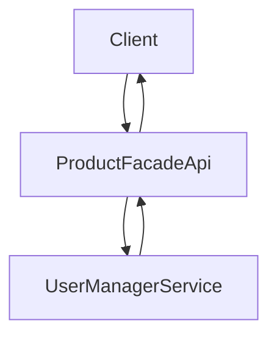

#№ Тестовое задание ЦРК Сота

Описание задания:
https://docs.google.com/document/d/1uPjrecuVEdYpcWsae7kLBq2kGA5C35Di5hOo9AW9N84/edit

### Схема работы сервисов

### Что реализовано из описания задачи:
- [x] Приложение для клиента (react + redux.).
- [x] Сервис для авторизации пользователей (IdentityServer4).
- [x] Сервис для постраничное отображение товаров.
- [x] Сохранение товаров в базу данных должно быть обернуто в транзакцию (UnitOfWork).
- [x] Middleware для кэширования.
- [x] Добавление товара.
- [ ] Наличие unit-тестов в серверной части.
- [ ] Наличие unit-тестов в клиентской части.
- [x] Виртуальная прокрутка списка товаров + динамическая подгрузка данных по прокрутке (можно использовать готовые компоненты).
- [ ] Очистку только устаревшей страницы из кэша.
- [ ] Загрузку изображений в интерфейсе создания товара и показ изображения в витрине (можно использовать готовый компонент для загрузки файлов).
- [x] Адаптивную верстку (можно использовать css-фреймворк).
- [ ] docker-compose (не запустилась сборка на windows).

### Запуск клиентского приложения
`yarn`

`yarn start`

### Подготовка БД и Redis

`docker-compose up -d`

### Для авторизации пользователей
Логин `test@one.com` или `test@two.com`

Пароль `1`